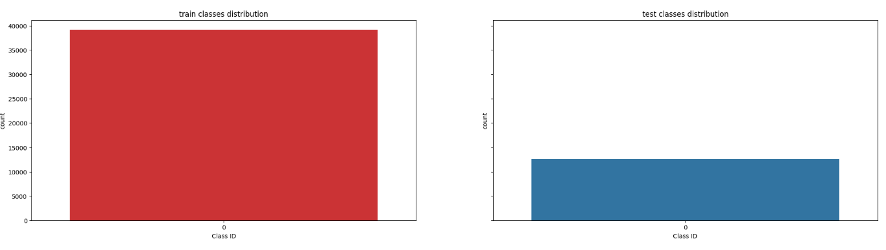
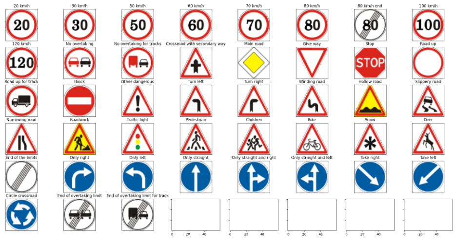
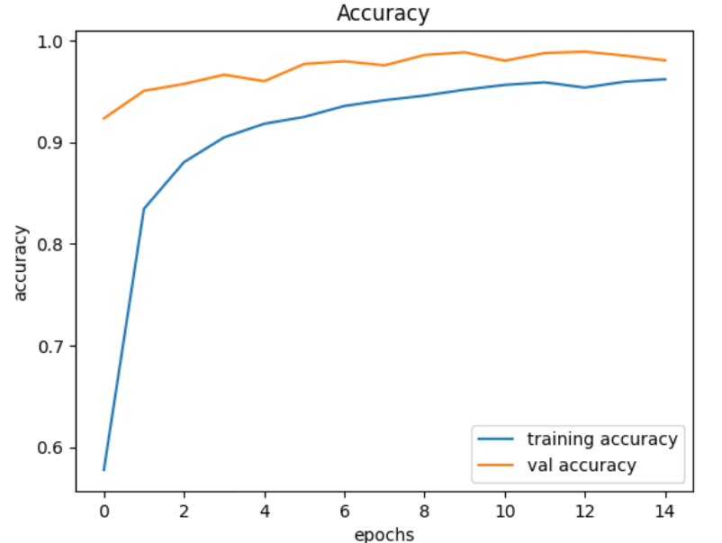
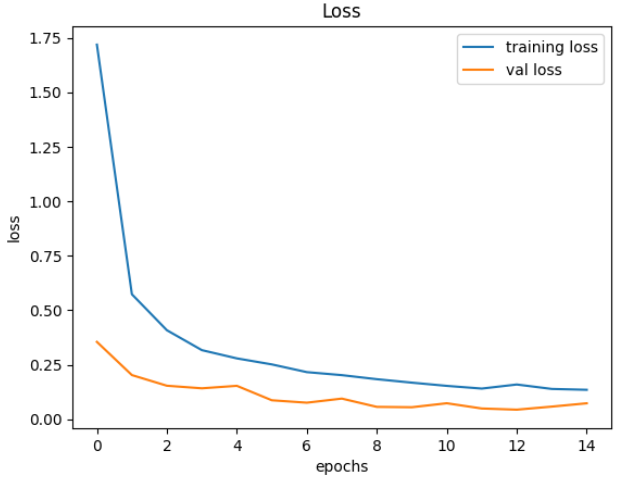
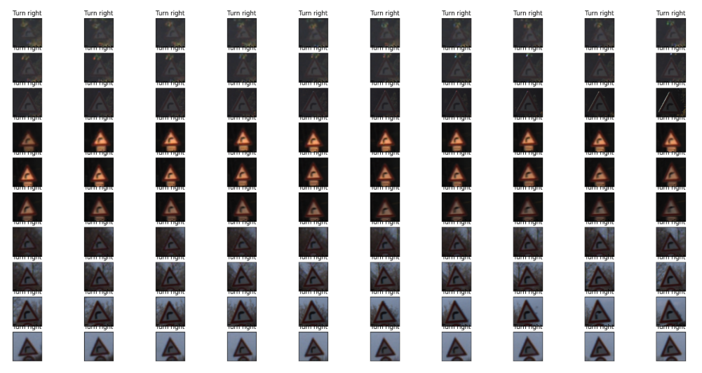

# Traffic Sign Classification using CNN  

This project is about building a **Convolutional Neural Network (CNN)** to classify **German Traffic Signs** into 43 categories using the [GTSRB dataset] https://www.kaggle.com/datasets/meowmeowmeowmeowmeow/gtsrb-german-traffic-sign  

# 📌 Project Overview  
Traffic signs are everywhere, and recognizing them correctly is a big part of making self-driving cars safe.  
In this project, I:  
- Explored and visualized the dataset.  
- Preprocessed images (resizing, normalization).  
- Built a CNN model using TensorFlow/Keras.  
- Trained it to classify 43 types of traffic signs.  
- Evaluated model performance using accuracy and loss curves.  

# 🛠️ Tech Stack  
- **Python**  
- **Libraries:** Pandas, NumPy, Matplotlib, Seaborn, OpenCV, PIL, TensorFlow/Keras, scikit-learn  

# 📂 Dataset  
- **GTSRB (German Traffic Sign Recognition Benchmark)**  
- Contains **43 classes** of traffic signs.  
- Split into **train**, **test**, and **meta** files.  

# Data Visualization  
- Plotted **class distribution histograms**.  
- Displayed sample images of each class.  
- Visualized a **grid of training samples**.

# Model Architecture (CNN)  
The CNN consists of:  
- 2 Convolutional layers with ReLU  
- MaxPooling + Dropout layers  
- 2 more Convolutional layers  
- Flatten + Dense (256 neurons, ReLU)  
- Output layer with 43 neurons (Softmax)    

# Evaluation  
- Plotted **accuracy** and **loss curves**.  
- Tested model accuracy on unseen data.

# 📊 Results  
- Achieved strong accuracy in classifying traffic signs.  
- Model successfully learned to differentiate between all 43 classes.  
- Plots clearly show training vs validation performance.
 
